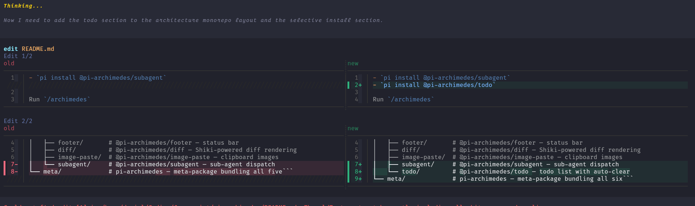
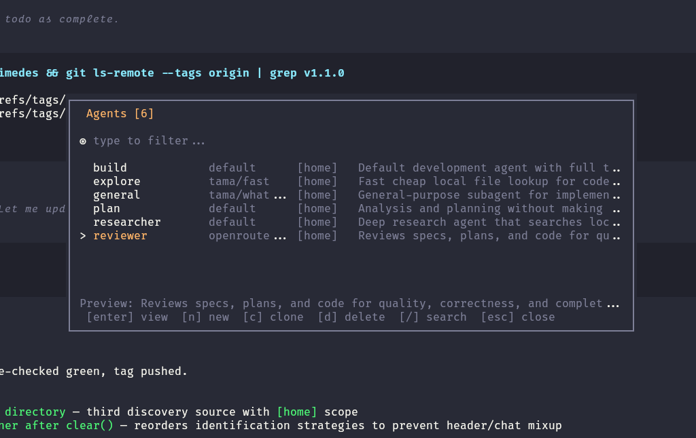
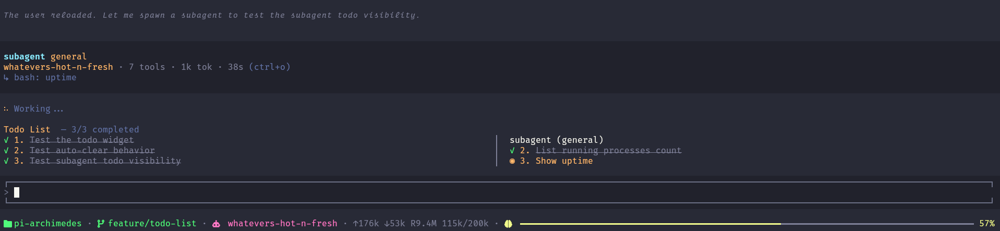

<div align="center">
  

# pi-archimedes

*A small, cohesive set of extensions for the Pi coding agent — built to be lived in*

[](https://www.npmjs.com/package/pi-archimedes)
[](https://www.typescriptlang.org)
[](LICENSE)

</div>

## Why pi-archimedes?

Pi's extension ecosystem is powerful, but extensions don't talk to each other. Install one and it has no idea another exists.

pi-archimedes is a set of extensions that actually cooperate. Subagent costs flow into the footer. Subagent todos appear alongside yours. When a subagent needs to ask you a question, the prompt surfaces in your TUI and the answer routes back. The diff renderer matches your theme. The splash screen sets the tone.

Everything shares a single point of view: minimal, but designed. Install once, stop thinking about it.

Want only one piece? Each package works standalone. Want only the footer? `pi install npm:@pi-archimedes/footer`. Only the diff renderer? `pi install npm:@pi-archimedes/diff`. Mix and match.

→ [Open an issue](https://github.com/danielcherubini/pi-archimedes/issues) · [Start a discussion](https://github.com/danielcherubini/pi-archimedes/discussions)

## Features

**When installed via the meta package, the ten components share state and cooperate.** For example, `@pi-archimedes/subagent` emits cost events through `@pi-archimedes/core/bus`; the footer picks them up via `CostAccumulator` and merges subagent tokens and cost into the main status bar. The agent manager reuses Core's chrome and color palette. Install pieces individually and these integrations disappear.

### 🎬 Core ([`@pi-archimedes/core`](packages/core/README.md))

The visual chrome you see on every Pi session.

- Animated splash screen with configurable styles
- Framed editor with double-press quit guard
- Muted thinking blocks

### 📊 Footer ([`@pi-archimedes/footer`](packages/footer/README.md))

A status bar that surfaces what matters without getting in the way.

- Directory, git branch (with clean/dirty indicator), worktree, model, thinking level
- Token stats (↑input ↓output + cost)
- Color-coded context window bar

### 🔍 Diff ([`@pi-archimedes/diff`](packages/diff/README.md))

Syntax-highlighted diffs that read at a glance.

- Shiki-powered split and unified views
- Word-level emphasis on changed characters
- Auto-derived theme colors
- Graceful fallback to plain text



### 🖼️ Image-paste ([`@pi-archimedes/image-paste`](packages/image-paste/README.md))

Paste screenshots straight into the chat.

- Paste images from clipboard (Ctrl+V on Linux, Alt+V on Windows) with inline preview

> **⚠️ Shortcut conflict:** On Linux, `ctrl+v` is also Pi's built-in shortcut for `app.clipboard.pasteImage`. To resolve the conflict, clear the built-in binding in `~/.pi/agent/keybindings.json`:
> ```json
> { "app.clipboard.pasteImage": [] }
> ```
> This lets archimedes' handler (which adds inline previews) take over without the warning.

### 🤖 Subagent ([`@pi-archimedes/subagent`](packages/subagent/README.md))

Dispatch work to other agents and watch them work in real time.

- Sub-agent dispatch with live TUI streaming
- Parallel execution mode
- Per-subagent tool counts and token usage
- Unified cost summary
- Color-coded tool calls — grey while running, green/red on completion
- Readable argument previews (no raw JSON)



#### `/agents` command

Full CRUD TUI for `.pi/agents/*.md` files — searchable list, model picker, tool picker, dirty-tracking, cross-scope collision warnings.

*Available when installed via `pi-archimedes` (the meta package), not as a standalone `@pi-archimedes/subagent` install.*

### 📋 Todo ([`@pi-archimedes/todo`](packages/todo/README.md))

Track work without leaving the session — including what your subagents are doing.

- `manage_todo_list` tool with read/write operations
- Auto-clear when all todos are completed
- Multi-column widget — main agent + per-subagent todos side by side
- `/todos` and `/todos clear` commands



### 💬 Ask ([`@pi-archimedes/ask`](packages/ask/README.md))

Ask structured questions and let the agent act on the answer — from the main agent **or** from inside a subagent.

Most question tools only work when the main agent calls them. Ask works everywhere: call it directly and you get the full interactive prompt; spawn a subagent that needs a decision, and its `ask` call surfaces in your TUI — the subagent blocks until you answer, then carries on with your choice. No temp files, no pipes — just a bidirectional IPC channel that feels instant.

**From the main agent:**
- Tabbed multi-question flow with submit review
- Single-question picker with instant submit
- Inline note editing per option
- Markdown context descriptions
- Multi-select support
- Automatic "Other (type your own)" handling

**From a subagent:**
- The same rich UI appears in the parent TUI, even mid-stream
- The subagent blocks on the call and receives your answer over IPC
- Works alongside live subagent streaming and cost tracking


### 🔔 Notify ([`@pi-archimedes/notify`](packages/notify/README.md))

Desktop notifications when you've stepped away — with a circuit breaker that cancels if you interact.

- Delayed notification on task complete or unanswered questions
- Terminal-aware dispatch: Ghostty, WezTerm, iTerm2, Kitty, Windows Terminal
- tmux passthrough for all OSC sequences
- Configurable delay and per-trigger toggles

### 🏷️ Session-name ([`@pi-archimedes/session-name`](packages/session-name/README.md))

Automatic session titles generated by AI after the first exchange in each session.

- Generates concise 3-8 word titles from the first user/assistant exchange
- Smart model resolution with provider/id, bare id, and thinking-suffix tolerance
- Respects manual names set via `--name` or `/name`
- Skips ephemeral sessions and handles errors silently

### 🔌 MCP ([`@pi-archimedes/mcp`](packages/mcp/README.md))

Full-featured MCP client adapter (feature parity with pi-mcp-adapter): any MCP server — stdio or HTTP — with a `mcp` proxy tool, per-server direct tools, a `/mcp` command family, two TUI panels, OAuth, and an offline metadata cache.

- Gateway `mcp` proxy tool — search, describe, and call tools across all configured servers, plus `status`, per-server tool listing, and eager `connect`
- Per-server direct tools registered as `{server}_{tool}` for token-efficient calls (a per-server `directTools` array narrows the registered set to named tools)
- `/mcp` command family — status, tools, prompts, reconnect, enable/disable, logout, auth, and the management + setup panels (below). The former standalone `/mcp-auth` / `/mcp-logout` commands are retired — their logic lives in `/mcp auth` / `/mcp logout` (and the panel)
- OAuth 2.1 + PKCE for protected servers — browser auth flow, OS credential-store persistence, SDK-driven token refresh
- Lifecycle management per server (`keep-alive` / `lazy` / `lazy-keep-alive` / `eager`) with configurable idle timeout
- Metadata cache (`~/.pi/agent/mcp-cache.json`, 7-day validity) — search/describe work offline, and tools connect lazily per call; also persists each server's last connection outcome, so `needs-auth`/error surfaces across sessions
- Compact two-line tool rendering — `mcp <target>` header (cyan + orange, matching pi's Dracula theme) plus a key-arg summary (`→ table: model_files`) whose key word is grey while running, green on success, red on failure, with a `(ctrl+o)` hint; full args and result text stay hidden until expanded (ctrl+o)
- Layered `mcp.json` server definitions (six layers, project `.pi` override wins) with safe single-field write-back — see Config files & write-back below

#### `/mcp` command

`/mcp` is the ONLY command family for MCP. Bare `/mcp` (no args) opens the management panel in the TUI and shows the text status list without one; an explicit `/mcp status` is always the text list. Unknown subcommands show usage.

| Subcommand | Behavior |
|------------|----------|
| `/mcp [status]` | One line per server: connected (with tool count), needs auth, error, disabled, or not connected — persisted outcomes carry an age suffix (e.g. `2m ago`) |
| `/mcp tools [server]` | Cached tools for one server (or all of them) — name + description, no connections opened |
| `/mcp prompts [server]` | Cached prompts for one server (or all of them) — name + description, no connections opened |
| `/mcp reconnect [server]` | Closes and reconnects one (or all) server(s); reports the settled status per server |
| `/mcp enable <server>` | Clears the server's `disabled` flag (written to the Pi override file) — then run `/reload` |
| `/mcp disable <server>` | Sets `disabled` and tears down the live connection — then run `/reload` |
| `/mcp logout <server>` | Deletes the server's stored credentials from the OS credential store |
| `/mcp auth <server>` | Interactive OAuth flow: progress loader, browser + URL fallback, esc cancels |
| `/mcp panel` | Opens the management panel (TUI overlay) |
| `/mcp setup` | Opens the setup panel (TUI overlay) |

#### Management panel (`/mcp panel`)

Browse and act on your servers in one overlay: a status glyph per server (● connected, ⚠ needs auth, ✗ error, ⊘ disabled, ○ cached), expandable tool lists, and inline actions. Field changes write to the Pi override file and take effect on the next `/reload`. With zero servers configured, `/mcp panel` (and bare `/mcp`) notifies you and redirects to the setup panel instead.

| Key | Action |
|-----|--------|
| `[↑]` / `[↓]` | Move between server rows and (expanded) tool rows |
| `[enter]` | Expand / collapse a server's tools — on a **needs-auth** server, runs the in-panel OAuth flow instead |
| `[a]` | Run the in-panel OAuth flow for the server under the cursor |
| `[space]` | Toggle direct tools: server row = all of its tools as a group, tool row = that one tool |
| `[e]` | Enable / disable the server (same write-back as `/mcp enable` / `disable`) |
| `[l]` | Log out (delete the stored credentials) |
| `[r]` | Reconnect the server under the cursor |
| `[/]` | Search filter over server names and tool names/descriptions (printable chars append, backspace edits) |
| `[ctrl+s]` | Save direct-tool changes for the changed servers to the Pi override file |
| `[esc]` | Close (unsaved toggles are discarded, no confirm) — while an in-panel OAuth flow is running, `[esc]` cancels it cleanly (a cancellation notice, not an error) and `[ctrl+c]` cancels and closes |

#### Setup panel (`/mcp setup`)

Onboarding for a new project. Every successful write targets the project-shared `.mcp.json` and prompts you to run `/reload`:

- **Scaffold minimal `.mcp.json`** — writes `{ "mcpServers": {} }` only when the file is absent (never clobbers an existing one)
- **Add a known server** — a small curated preset list (context7, chrome-devtools, deepwiki, fetch); existing entries are never overwritten (add-if-absent)
- **Import from another tool** — discovers MCP configs owned by other hosts (JSON only): Cursor (`~/.cursor/mcp.json`, `.cursor/mcp.json`), Claude Code (`~/.claude/mcp.json`, `~/.claude.json`), Claude Desktop (`~/.claude/claude_desktop_config.json`), and VSCode (`.vscode/mcp.json`). Check one or more sources (or all) and review a **preview** of exactly which server names will be added — names already in `.mcp.json` are kept untouched — before writing

#### OAuth

OAuth-protected MCP servers (Atlassian, Notion, GitHub, …) are supported via OAuth 2.1 + PKCE, on top of the static bearer tokens already available for HTTP servers. Three paths reach the same single auth entry point:

- `/mcp auth <server>` — interactive browser flow with a progress loader (esc cancels); opens the authorization URL in the browser and prints it as a fallback. On success the client reconnects so the freshly stored token is used immediately
- In-panel — `[a]`, or `[enter]` on a needs-auth server, in `/mcp panel`; `[esc]` cancels cleanly
- `autoAuth: true` (setting) — a tool call hitting a `needs-auth` server triggers the flow inline and retries the call once (default: the call returns guidance to run `/mcp auth <server>` instead)

Details:

- `/mcp logout <server>` (or `[l]` in the panel) deletes the stored credentials
- Tokens persist in the OS credential store (macOS Keychain / Windows Credential Manager / Linux libsecret) with a fail-closed policy — no plaintext fallback when the keyring is unavailable
- Token refresh is SDK-driven. The one exception (ADR 0001): a pre-registered public client (`clientId` without `clientSecret`) is never auto-refreshed — when its token expires, re-run `/mcp auth <server>`
- The `auth` field on an http/sse server definition accepts three shapes:
  - `{ "token": "…" }` — static bearer token
  - `"oauth"` — OAuth 2.1 with defaults
  - an object — `McpOAuthConfig` with `grantType` (`"authorization_code"` default, or `"client_credentials"`), `clientId`, `clientSecret`, `scope`, `redirectUri`, `clientName`; `authorizationServerUrl` is recognized but unused (reserved) — the client discovers the authorization server from the MCP server URL

#### Config files & write-back

Server definitions load from six layers, lowest → highest precedence (per-server field-level merge; a later layer wins):

| # | File | Scope |
|---|------|-------|
| 1 | `~/.config/mcp/mcp.json` | Global (standard MCP location) |
| 2 | `~/.agents/mcp.json` | Cross-agent (home) |
| 3 | `~/.agents/mcp/mcp.json` | Cross-agent (home) |
| 4 | `~/.pi/agent/mcp.json` | Pi agent dir (overridable via `PI_CODING_AGENT_DIR`) |
| 5 | `<project>/.mcp.json` | Project-shared (committable) |
| 6 | `<project>/.pi/mcp.json` | Pi override — highest precedence |

Files accept `//` comments and trailing commas. When a higher-precedence layer points a server at a different `url`, the `auth` / `headers` / `bearerTokenEnv` inherited from lower layers are dropped — credentials are never sent to an endpoint the user didn't explicitly configure for them.

The adapter writes to exactly two targets, one field at a time:

- **Field changes** — `disabled` (via `/mcp enable` / `disable` and `[e]` in the panel) and `directTools` (via `[ctrl+s]`) go to `<project>/.pi/mcp.json` **only**; existing fields, other servers, and any other top-level keys are preserved verbatim, and credentials are never copied
- **Server definitions** — new servers from `/mcp setup` (scaffold, known presets, imports) go to the project-shared `<project>/.mcp.json`; the write is add-if-absent, so an existing entry is never overwritten

Changes to either file take effect on the next `/reload`.

### 🔐 Sudo ([`@pi-archimedes/sudo`](packages/sudo/README.md))

Safe privileged execution: a dedicated `sudo_exec` tool with a masked password prompt, plus a guard that keeps the ordinary `bash` tool from driving interactive `sudo`.

- `sudo_exec` tool — runs a privileged command via `sudo -S` with a masked interactive password prompt and a command confirmation; the password travels only over stdin — never argv, env, logs, or files — and the tool's output is scrubbed with the password masked
- Single in-memory credential cache with TTL (default 15 min, `ttlMs`) — never written to disk or the OS keyring; cleared on `session_shutdown`, on `/sudo forget`, on auth failure, and at TTL expiry
- Bash guard — active `tool_call` veto (ADR 0010): interactive `sudo` through the built-in `bash` tool is always **blocked**, funneling privileged execution through `sudo_exec`; non-interactive forms (`sudo -n`, `-l`, `-v`, `-K`, `-k`, `--non-interactive`) pass through untouched
- `/sudo` command — reports whether a credential is cached; `/sudo forget` clears it from memory
- Headless sessions (subagent children) are blocked on `sudo_exec` with a clear error rather than prompted — the mask prompt only ever appears in a human's TUI

> **Caveat:** the bash guard blocks interactive sudo *everywhere* — including one-off human-directed agent runs. Use `sudo_exec` for anything privileged.
>
> **Caveat:** the timeout/abort kill covers the command's process group; a command that detaches itself into its own session (`setsid`/daemonizing) is beyond that kill by design (same reach as `tmux kill-pane`) — give it a managed lifecycle flag (e.g. `--foreground`) instead.
>
> **Caveat:** on sudoers that retain no reusable credential ticket, an unrecognizable failure can't be told apart from auth failure — it follows a two-consecutive-failure rule: warning on the first, cache cleared on the second, so a wrong password is detected on the second failure, not the first.

### 🧩 Plugin manager (`pi-archimedes`)

*Available when installed via `pi-archimedes` (the meta package), not via individual standalone installs.*

Every non-core package is an **optional plugin** — the ten components above all default on, but each can be switched off independently. The plugin list lives in a single manifest (`meta/src/plugins.ts`), which gates registration, the `/archimedes` settings items, and shutdown. Each plugin's on/off switch is the `enabled` key inside **its own** `archimedes.<pkg>` namespace in `~/.pi/agent/settings.json` (absent = on); only the meta package reads or writes it.

#### `/plugins` command

Run `/plugins` to open the plugin manager. Each installed plugin appears as a row with its description and current state (On/Off). Navigate with arrow keys, press ←/→ on a row to flip its state — the change persists immediately to that package's own namespace (`archimedes.<pkg>.enabled`) — and press ESC to close. A disabled plugin stops being registered on the next `/reload`: its tools, commands, and `/archimedes` settings rows disappear with it.

## Quick Start

```bash
pi install npm:pi-archimedes
```

That's it. Reload Pi and you're set.

### Or install selectively

- `pi install npm:@pi-archimedes/core`
- `pi install npm:@pi-archimedes/footer`
- `pi install npm:@pi-archimedes/diff`
- `pi install npm:@pi-archimedes/image-paste`
- `pi install npm:@pi-archimedes/subagent`
- `pi install npm:@pi-archimedes/todo`
- `pi install npm:@pi-archimedes/ask`
- `pi install npm:@pi-archimedes/notify`
- `pi install npm:@pi-archimedes/session-name`
- `pi install npm:@pi-archimedes/mcp`
- `pi install npm:@pi-archimedes/sudo`

## Settings

Run `/archimedes` to open the interactive settings panel. Navigate with arrow keys, press Enter to toggle or edit, Save to persist, ESC to cancel.

Each package reads from its own namespace in `~/.pi/agent/settings.json` — for example, `@pi-archimedes/footer` reads from `archimedes.footer`.

### `pi-archimedes` (meta)

No meta-specific user settings. Per-plugin on/off switches live in each package's own namespace (`archimedes.<pkg>.enabled`, default on) and are managed via the `/plugins` command.

### [`@pi-archimedes/core`](packages/core/README.md)

| Setting | Type | Default | Description |
|---------|------|---------|-------------|
| `mutedTheme` | bool | `false` | Use subdued colors for thinking blocks |
| `codeUnindent` | bool | `true` | Remove common indentation from code blocks inside thinking sections |
| `labelText` | string | `Thinking...` | Custom prefix shown before thinking blocks |
| `labelColor` | string | `255,215,0` | RGB color for the thinking label |
| `animationStyle` | string | `vertical-up` | Splash animation style (9 options) |

### [`@pi-archimedes/footer`](packages/footer/README.md)

| Setting | Type | Default | Description |
|---------|------|---------|-------------|
| `splitThreshold` | number | `150` | Minimum terminal columns where a single-line footer is allowed (below, at least two lines; above, wraps instead of clipping when it overflows) |

### [`@pi-archimedes/diff`](packages/diff/README.md)

| Setting | Type | Default | Description |
|---------|------|---------|-------------|
| `diffTheme` | string | `github-dark` | Shiki syntax-highlighting theme |
| `diffSplitMinWidth` | number | `150` | Minimum terminal columns to show split diff view (≥ 100) |
| `diffSplitMinCodeWidth` | number | `60` | Minimum code columns per side in split view (≥ 30) |

### [`@pi-archimedes/image-paste`](packages/image-paste/README.md)

Uses Pi's core `terminal.showImages` setting to control inline previews. No package-specific settings.

### [`@pi-archimedes/subagent`](packages/subagent/README.md)

No settings yet. Tool/cost events flow through `@pi-archimedes/core/bus` for the footer to consume.

### [`@pi-archimedes/ask`](packages/ask/README.md)

No settings yet.

### [`@pi-archimedes/notify`](packages/notify/README.md)

| Setting | Type | Default | Description |
|---------|------|---------|-------------|
| `notifyOnAgentEnd` | bool | `true` | Notify when agent finishes a task |
| `notifyOnQuestion` | bool | `true` | Notify when a question needs your answer |
| `delayMs` | number | `30000` | Milliseconds to wait before sending notification (default 30 seconds) |

On/off is managed by the suite: toggle via `/plugins` (`archimedes.notify.enabled`, default on).

### [`@pi-archimedes/session-name`](packages/session-name/README.md)

| Setting | Type | Default | Description |
|---------|------|---------|-------------|
| `model` | string | _(current model)_ | Override model for title generation |

On/off is managed by the suite: toggle via `/plugins` (`archimedes.sessionName.enabled`, default on).

### [`@pi-archimedes/mcp`](packages/mcp/README.md)

| Setting | Type | Default | Description |
|---------|------|---------|-------------|
| `directTools` | bool | `true` | Register per-server direct tools (`{server}_{tool}`) in the tool list |
| `toolPrefix` | string | `"server"` | Tool name prefix strategy (`"server"` \| `"none"` \| `"short"` \| `"mcp"`) |
| `idleTimeout` | number | `10` | Idle timeout in minutes before open connections close (`0` disables) |
| `warnOnLargeDirectTools` | bool | `true` | Reserved — parsed but not yet effective (see note below) |
| `autoAuth` | bool | `false` | Trigger the interactive OAuth flow inline — and retry the call once — when a tool call hits a `needs-auth` server (default: return guidance to run `/mcp auth`) |

Per-server settings in the `mcp.json` server definitions override these defaults: `lifecycle` (`"keep-alive"` \| `"lazy"` \| `"lazy-keep-alive"` \| `"eager"`, default `"lazy"`), `idleTimeout`, `directTools` (boolean, or a `string[]` of tool names to expose), `includeTools`, `excludeTools`, `toolPrefix`, `exposeResources`, `debug` (stdio servers: route stderr to the terminal), `requestTimeoutMs`, `protocolVersion`, and `disabled`. A per-server `disabled: true` keeps the server out of the live set — no managed client, no direct tools, omitted from the `mcp` proxy tool's status list — while `/mcp status` and the panel still show it as disabled; re-enable with `/mcp enable <server>` plus `/reload`. http/sse servers additionally take `auth` — a static bearer (`{"token": "…"}`), the string `"oauth"`, or an `McpOAuthConfig` object (see the OAuth section above) — plus `headers` and `bearerTokenEnv`.

> **Note on reserved settings:** `warnOnLargeDirectTools` (global) and the per-server `exposeResources`, `requestTimeoutMs`, and `protocolVersion` are part of the planned port — they are parsed (and, where applicable, folded into the metadata cache's config hash) but **not yet effective**: setting them has no runtime behaviour.

A metadata cache at `~/.pi/agent/mcp-cache.json` (valid for 7 days) stores each server's tools/resources/prompts so the gateway can search and describe offline, connecting servers lazily per tool call. It also persists each server's last connection outcome, so `/mcp status` and the panel can surface a `needs-auth`/error from a previous session (with an age suffix once it grows stale).

### [`@pi-archimedes/sudo`](packages/sudo/README.md)

| Setting | Type | Default | Description |
|---------|------|---------|-------------|
| `ttlMs` | number | `900000` | Password cache TTL in milliseconds (default 15 minutes) |
| `defaultTimeoutMs` | number | `120000` | `sudo_exec` default command timeout in milliseconds (default 120 seconds) |

On/off is managed by the suite: toggle via `/plugins` (`archimedes.sudo.enabled`, default on). Config is JSON-only in the `archimedes.sudo` namespace of `~/.pi/agent/settings.json` — there is no settings-panel UI in v1.

## Architecture

### Monorepo layout

```
pi-archimedes/
├── packages/
│   ├── core/         # @pi-archimedes/core — editor, message, startup, thinking
│   ├── ask/          # @pi-archimedes/ask — structured question tool
│   ├── footer/       # @pi-archimedes/footer — status bar
│   ├── diff/         # @pi-archimedes/diff — Shiki-powered diff rendering
│   ├── image-paste/  # @pi-archimedes/image-paste — clipboard images
│   ├── subagent/     # @pi-archimedes/subagent — sub-agent dispatch
│   ├── todo/         # @pi-archimedes/todo — todo list with auto-clear
│   ├── notify/       # @pi-archimedes/notify — delayed desktop notifications
│   ├── session-name/ # @pi-archimedes/session-name — auto session naming
│   ├── mcp/          # @pi-archimedes/mcp — MCP client adapter with pi-native TUI
│   └── sudo/         # @pi-archimedes/sudo — sudo_exec + interactive-sudo bash guard
└── meta/             # pi-archimedes — meta-package bundling all eleven
```

Each package is a focused TypeScript ESM module with its own `src/index.ts` entry point.

See [AGENTS.md](AGENTS.md) for import conventions, config namespaces, and contribution workflow.

### Requirements

- Pi TUI with extension support
- Node.js >= 24
- pnpm >= 10 (for development — `npm install` is not supported; `packageManager` field pins pnpm via Corepack)

## Development

This is a pnpm workspace. To work on the source:

```bash
git clone https://github.com/danielcherubini/pi-archimedes
cd pi-archimedes
pnpm install
pnpm -r exec -- tsc --noEmit   # type-check all packages
```

Symlink into your Pi extensions to test:

```bash
ln -s $(pwd) ~/.pi/agent/extensions/pi-archimedes
```

Root `package.json` declares `"extensions": ["meta/src/index.ts"]` — Pi loads it from the symlink.

See [AGENTS.md](AGENTS.md) for import conventions, config namespaces, and the release workflow.
