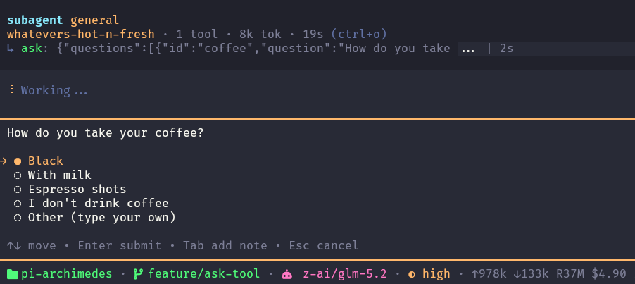

# @pi-archimedes/ask

Structured question tool with tabbed multi-question flow and inline note editing.

## Install

```bash
pi install @pi-archimedes/ask
```

## Features

- Tabbed multi-question flow with submit review
- Single-question picker with instant submit
- Inline note editing per option
- Markdown context descriptions
- Automatic "Other (type your own)" handling
- Subagent support — subagents can call `ask` and the question appears in the parent's TUI (bidirectional IPC, no temp files)



## RPC clients

In Pi RPC mode, `ask` uses Pi's standard extension UI protocol so embedding clients can render native question controls. Single-choice questions use `select`, custom answers use `input`, multiple questions are shown sequentially, and multi-select questions use a toggle-and-Done flow.

Interactive terminal sessions keep the richer tabbed interface with inline note editing. RPC mode does not provide the custom terminal component API, so ordinary-option inline notes are not available there.

## Dependencies

Depends on [`@pi-archimedes/core`](../core) for the shared event bus used to relay subagent questions.

## Settings

No settings yet.
