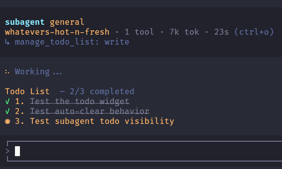

# @pi-archimedes/todo

Todo list management with auto-clear and live subagent visibility for the [Pi coding agent](https://github.com/earendil-works/pi).

Track complex multi-step tasks structured in a todo list with automatic clearing on completion and live side-by-side visibility into subagent tasks. Having an active progress display keeps long tasks on track and gives both you and the model clear visibility into completed steps and next actions.

## What you get

- **`manage_todo_list` tool** — structured todo tracking with `read` and `write` operations
- **Auto-clear** — when all todos are completed, the list clears itself after a brief 2-second delay
- **Multi-column widget** — main agent todos on the left, each subagent's todos in their own column to the right
- **Live subagent visibility** — subagent todos stream through the core bus so you can see what they're working on
- **`/todos` command** — toggle the widget or clear todos (`/todos clear`)
- **Session persistence** — todos survive `/reload` via session branch reconstruction

## Screenshots

### Multiple todos with progress tracking

Widget showing three todos with completion status — completed items dimmed with strikethrough, the item currently being worked on highlighted:



### Main agent + subagent side by side

Main agent todos (left) alongside a subagent's todos (right), separated by a divider. Subagent column auto-removes when the subagent finishes:


## Install

```bash
pi install npm:@pi-archimedes/todo
```

Or install full meta package:

```bash
pi install npm:pi-archimedes
```

## Usage

### As a tool

The `manage_todo_list` tool accepts two operations:

**Read current todos:**

```jsonc
{
  "operation": "read"
}
```

**Write (replace) the todo list:**

```jsonc
{
  "operation": "write",
  "todoList": [
    { "content": "Parse config files", "description": "Read and validate all config files", "status": "in_progress" },
    { "content": "Build state manager", "description": "Implement TodoStateManager class", "status": "pending" },
    { "content": "Wire up widget", "description": "Connect widget to bus events", "status": "pending" }
  ]
}
```

### As a command

- `/todos` — toggle the todo widget visibility
- `/todos clear` — clear all todos immediately

## Todo statuses

| Status | Icon | Description |
|--------|------|-------------|
| `pending` | ○ | Not yet begun |
| `in_progress` | ◉ | Currently being worked on |
| `completed` | ✓ | Fully finished |

## Auto-clear

When all todos in the list are marked as `completed`, the widget shows the all-done state for 2 seconds, then auto-clears. No need to manually run `/todos clear`.

## Integration

When installed via `pi-archimedes` (the meta package), subagent todo events flow through `@pi-archimedes/core/bus` and appear as separate columns in the widget. Each subagent gets its own column labeled with its agent name. The column auto-removes when the subagent finishes.

← Back to [pi-archimedes](../../README.md)
